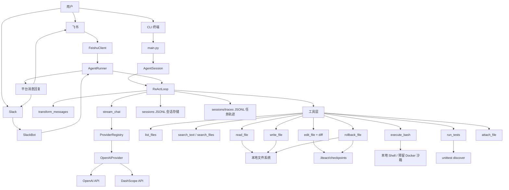

# LiteAct Agent

LiteAct Agent 是一个轻量级 Python Coding Agent Runtime，用于探索 AI Agent 开发中的核心能力：大模型接入、流式对话、工具调用、会话记忆、本地文件读写、命令执行、任务级 trace、执行验证，以及飞书/Slack 等聊天平台集成。

这个项目不是基于 LangChain、Dify 或 LlamaIndex 这类重型框架封装出来的 Demo，而是用原生 Python 手写了一套简化版 Agent 运行链路。项目重点展示的是：如何把大语言模型从“聊天接口”扩展成一个能读取工程、执行工具、保存上下文并持续完成任务的自动化助手。

## 项目定位

本项目定位为一个 AI 应用开发方向的工程实践项目，主要体现以下能力：

- 理解 LLM 应用的基本工程链路：输入、上下文、模型调用、工具调用、结果回填。
- 能够设计 Agent 的核心 ReAct 循环，而不是只调用一次聊天 API。
- 能够对接 OpenAI-compatible API，包括 OpenAI 和 DashScope 通义千问兼容模式。
- 能够处理流式输出、工具调用增量解析、超时重试、会话持久化等真实工程问题。
- 能够把 Agent 接入 CLI、飞书、Slack 等不同入口，体现跨平台适配能力。

## 核心功能

### 1. ReAct 推理与工具调用

`ReActLoop` 是项目的核心调度器。它会把用户输入、历史上下文和可用工具说明一起发给大模型，由模型判断是否需要调用工具。

当前默认工具包括：

- `list_files`：安全列出工作区目录，支持深度控制、常见目录过滤和 100 条截断。
- `search_text`：在工作区内按正则搜索文本，返回 `文件:行号:内容`。
- `search_files`：按 glob 查找文件名，适合快速定位入口文件。
- `read_file`：读取本地文件，支持分页和安全截断。
- `write_file`：写入本地文件，支持原子化写入和并发锁。
- `edit_file`：基于唯一匹配做局部替换，返回 unified diff，支持 `preview_only` 预览，并在写入前生成 checkpoint。
- `rollback_file`：按 `checkpoint_id` 或文件路径恢复最近一次 `edit_file` / `write_file` 之前的内容。
- `execute_bash`：执行本地 Shell 命令，支持超时控制、输出截断，以及 Windows 下的 `python3 -> python` 轻量兼容。
- `run_tests`：运行工作区内的 Python `unittest`，用于代码修改后的执行验证。

在飞书/Slack 平台适配场景中，Runner 还会额外挂载：

- `safe_ls`：安全列出目录结构。
- `search_text`：全文内容搜索。
- `search_files`：按文件名通配符搜索。
- `attach_file`：把生成文件作为附件发送回聊天平台。

### 2. 大模型统一适配层

项目通过 `ProviderRegistry` 管理不同模型服务，并用 `OpenAIProvider` 将内部消息协议转换为 OpenAI Chat Completions 格式。

目前支持：

- OpenAI API
- DashScope 通义千问 OpenAI-compatible API

模型调用入口统一为 `stream_chat()`，它负责：

- 根据 `api_type` 找到对应 Provider。
- 发起流式模型请求。
- 使用 `tenacity` 处理限流、连接错误和超时重试。
- 将模型输出统一转换成 `TextDelta`、`ThinkingDelta`、`ToolCallDelta`、`UsageEvent`。

### 3. 会话记忆与 JSONL 持久化

项目使用本地 JSONL 文件保存会话历史。每一条用户消息、助手消息都会被追加写入文件，方便恢复上下文。

这套机制的好处是简单、透明、容易调试：

- 不依赖数据库。
- 一行就是一条 JSON 记录。
- 可以直接查看历史对话和工具调用结果。

默认存储位置：

```text
sessions/
```

### 4. 任务级 Trace 与执行验证

每次 `AgentSession.prompt()` 都会在 `sessions/traces/` 下写入一份 JSONL trace，记录：

```text
plan -> step_start -> tool_call -> tool_result -> verification -> final
```

这份 trace 用于面试演示和问题定位：可以看到模型使用了哪些工具、工具是否报错、执行后是否进入恢复流程，以及最终任务状态。`execute_bash` 增加了工作区 `cwd` 绑定、危险命令拦截、30 秒默认超时和 32KB 输出截断；`run_tests` 则把测试验证从任意 shell 命令中拆成了独立工具。

查看最近一次任务摘要：

```powershell
python scripts\trace_summary.py
```

也可以指定某个 trace：

```powershell
python scripts\trace_summary.py sessions\traces\20260530_default_cli_xxxxxxxx.jsonl
```

### 5. CLI 终端交互

项目提供基于 Rich 的终端交互界面，支持：

- 彩色启动提示。
- 用户输入循环。
- Markdown 渲染。
- 流式输出展示。
- 工具调用状态展示。

CLI 入口文件：

```text
main.py
```

### 6. 飞书与 Slack 平台适配

项目包含飞书和 Slack 适配层，用于把聊天平台消息转换为 Agent 能理解的统一 payload。当前主 Demo 推荐使用 CLI；飞书和 Slack 更适合作为平台扩展能力展示，实际运行需要配置对应平台应用和回调环境。

飞书代码提供两种入口：

- HTTP Webhook：`src/feishu_app.py`
- Socket Mode：`src/feishu_socket_app.py`

Slack 适配器位于：

```text
src/ai/slack_client.py
```

## 技术栈

项目主要技术栈如下：

- Python：核心开发语言。
- asyncio：异步任务调度和流式处理。
- Pydantic：定义消息、事件、工具结果等结构化数据模型。
- OpenAI SDK：对接 OpenAI 和 OpenAI-compatible API。
- Tenacity：模型请求重试。
- Rich：终端 UI 和流式渲染。
- FastAPI / Uvicorn：飞书 Webhook 服务。
- lark-oapi：飞书开放平台 SDK。
- slack-sdk：Slack Socket Mode 和 Web API。
- Docker SDK：预留 Docker 沙箱执行能力。

## 快速开始

### 1. 克隆项目

```bash
git clone https://github.com/Iterate101/liteact-agent.git
cd liteact-agent
```

### 2. 安装依赖

```bash
pip install -r requirements.txt
```

### 3. 配置模型 API Key

使用 DashScope 通义千问：

```powershell
$env:API_TYPE="dashscope"
$env:DASHSCOPE_API_KEY="你的 DashScope API Key"
$env:MODEL_ID="qwen-max"
```

或者使用 OpenAI：

```powershell
$env:API_TYPE="openai-responses"
$env:OPENAI_API_KEY="你的 OpenAI API Key"
$env:MODEL_ID="gpt-4o"
```

也可以参考 `.env.example` 查看完整环境变量示例。

如果旧会话中保存了很多失败调试记录，可以用新的会话 ID 启动，避免模型被旧上下文误导：

```powershell
$env:SESSION_ID="clean_cli"
python main.py
```

### 4. 启动 CLI

```bash
python main.py
```

启动后可以直接输入任务，例如：

```text
请阅读 main.py，说明这个项目的启动流程
```

退出 CLI 时可以输入：

```text
q
exit
quit
退出
```

## 项目结构

```text
liteact-agent/
├── main.py                     # CLI 启动入口
├── requirements.txt            # Python 依赖清单
├── .env.example                # 环境变量示例
├── src/
│   ├── agent/                  # Agent 会话、推理循环、平台 Runner
│   ├── ai/                     # 模型 Provider、流式调用、平台客户端
│   ├── models/                 # Pydantic 消息协议模型
│   ├── tools/                  # 文件、命令、搜索、附件等工具
│   ├── ui/                     # Rich 终端 UI
│   └── utils/                  # 锁、编辑引擎、多媒体辅助函数
├── tests/                      # 功能测试和集成测试
└── sessions/                   # 本地会话持久化目录
```

## 核心调用链

### CLI 对话链路

```text
main.py
  -> AgentSession.prompt()
  -> SessionManager.get_context()
  -> ReActLoop.run_loop()
  -> stream_chat()
  -> OpenAIProvider.stream()
  -> 工具调用
  -> ToolResultMessage 回填上下文
  -> AgentTUI.render_stream()
```

### 工具调用链路

```text
ReActLoop
  -> 将工具转换为 OpenAI tools schema
  -> 模型返回 ToolCallDelta
  -> 根据工具名从 self.tools 中找到工具
  -> 执行工具 execute()
  -> 将结果包装成 ToolResultMessage
  -> 继续下一轮模型推理
```

## 架构图



## 项目亮点

### 1. 没有依赖重型 Agent 框架

项目手写了模型协议、工具协议、推理循环和持久化逻辑，有助于展示对 Agent 底层机制的理解。

### 2. 工具调用不是硬编码规则

代码不会简单根据关键词决定调用哪个工具，而是把工具的 `name`、`description`、`parameters` 发给模型，由模型根据上下文选择工具。

### 3. 具备工程容错意识

项目中包含多处工程保护：

- 模型请求超时重试。
- 文件读取大小限制。
- 命令输出截断。
- 危险命令拦截。
- 工作区路径边界。
- 写文件原子化。
- 局部编辑唯一性校验。
- 局部编辑 diff 预览。
- 同路径写入锁。
- 历史消息修复。
- 孤立工具调用自动补全。

### 5. 具备可执行评测的 Agent Case

`eval/agent_cases.json` 中整理了 11 条 Agent 评测 case，覆盖代码阅读、局部修改、测试运行、错误修复、搜索定位、安全拒绝、工作区边界、上下文恢复、trace 完整性、长输出截断和 patch rollback。评测脚本会使用 fake-provider 驱动 `AgentSession + ReActLoop + 本地工具`，不依赖真实模型 API。

运行离线评测：

```powershell
python -B eval\run_eval.py
```

当前离线评测结果：

```text
11/11 cases passed
17 tool calls
3 expected tool errors (failing test before fix, dangerous command, outside workspace)
4 checkpoints
rollback success rate 1.0
avg latency about 200 ms
```

检查评测集格式：

```powershell
python -B eval\run_eval.py --dry-run
```

### 4. 支持多入口适配

同一套 Agent 核心可以被 CLI、飞书、Slack 复用，体现了入口层和核心逻辑层的解耦。

## 当前限制

这个项目仍然是一个持续迭代中的 Agent 工程原型，当前还有一些可以继续完善的地方：

- `rollback_file` 已支持按 checkpoint 恢复文本文件；后续还可以加入交互式确认和批量 patch 事务。
- Slack 适配器存在，但缺少独立启动脚本。
- 飞书 HTTP Webhook 和 Socket Mode 入口需要结合真实平台配置继续联调验证。
- Docker 沙箱能力已经预留，但默认执行器仍使用本地 Shell。

## 后续优化方向

- 补充一键启动脚本。
- 为 `edit_file` 增加交互式确认步骤和多文件 patch 事务。
- 增加更严格的文件系统沙箱边界。
- 加入 Web UI 或前后端分离界面。
- 引入向量检索，实现代码语义搜索。
- 将离线评测报告接入 CI，并按 case 维度持续跟踪回归。
- 将会话存储抽象为可切换的 SQLite / PostgreSQL 后端。

## 实践重点

通过这个项目，我重点实践了 AI 应用开发中最关键的几类问题：

- 如何设计大模型应用的数据协议。
- 如何处理流式输出和工具调用。
- 如何把模型能力和本地工程工具结合起来。
- 如何保存并恢复多轮对话上下文。
- 如何在不同平台入口下复用同一套 Agent 核心。
- 如何在原型阶段兼顾功能实现、工程边界和可维护性。

因此，LiteAct Agent 不只是一个聊天机器人，而是一个面向 AI 应用开发场景的 Agent 工程原型。
