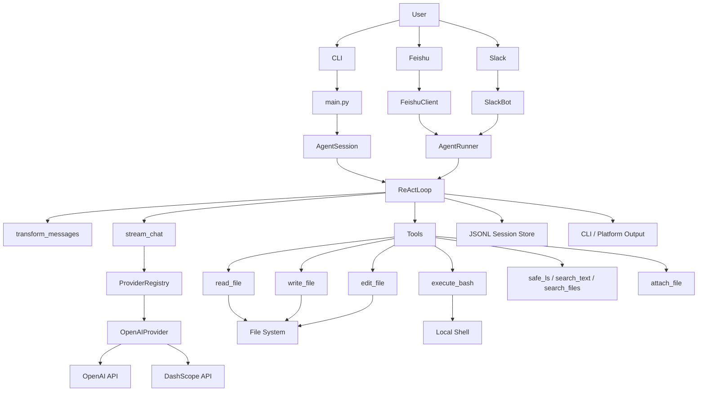

# LiteAct Agent

LiteAct Agent 是一个轻量级 Python Coding Agent。项目实现了 ReAct 推理循环、OpenAI-compatible 模型适配、本地工具调用、流式事件解析和 JSONL 会话持久化，可通过 CLI 完成文件读取、文件写入、局部编辑和命令执行等工程任务。

项目未依赖 LangChain、Dify、LlamaIndex 等 Agent 框架，核心链路由原生 Python 实现，主要用于验证 LLM Agent 在协议建模、工具调度、上下文管理和多入口适配中的工程结构。

## Status

| 模块 | 状态 | 说明 |
| --- | --- | --- |
| CLI | 可运行 | 主验证入口，支持 Rich 流式渲染和工具状态展示 |
| ReAct Loop | 已实现 | 支持多轮模型调用、工具执行、结果回填 |
| Tool Calling | 已实现 | 默认注册 `read_file`、`write_file`、`edit_file`、`execute_bash` |
| Session Store | 已实现 | 使用 `sessions/*.jsonl` 记录消息链 |
| Model Provider | 已实现 | 支持 OpenAI 与 DashScope OpenAI-compatible API |
| Feishu / Slack | 原型 | 已有适配层，生产部署仍需平台侧联调 |
| Docker Sandbox | 预留 | 默认命令执行仍使用本地 Shell |

## Features

- ReAct 推理循环：模型可基于上下文发起工具调用，并在工具结果回填后继续推理。
- 统一模型适配：通过 `ProviderRegistry` 和 `OpenAIProvider` 对接 OpenAI-compatible API。
- 流式事件模型：将模型输出转换为 `TextDelta`、`ThinkingDelta`、`ToolCallDelta`、`UsageEvent`。
- 工具注册机制：工具实现统一暴露 `name`、`description`、`parameters` 和 `execute()`。
- 会话持久化：使用 JSONL 保存用户消息、助手消息和工具结果。
- 平台扩展入口：CLI 为主路径，飞书和 Slack 复用同一套 Agent Runner。

## Tech Stack

| 技术 | 用途 |
| --- | --- |
| Python / asyncio | 核心实现与异步流式处理 |
| Pydantic | 消息、事件、工具结果建模 |
| OpenAI SDK | OpenAI-compatible API 调用 |
| Tenacity | 模型请求重试 |
| Rich | CLI 渲染 |
| FastAPI / Uvicorn | 飞书 HTTP Webhook |
| lark-oapi | 飞书平台 SDK |
| slack-sdk | Slack Socket Mode 与 Web API |
| pytest | 自动化测试 |

## Quick Start

```bash
git clone <your-repo-url>
cd liteact-agent
python -m venv .venv
```

Windows PowerShell:

```powershell
.\.venv\Scripts\Activate.ps1
pip install -r requirements.txt
```

macOS / Linux:

```bash
source .venv/bin/activate
pip install -r requirements.txt
```

DashScope, Windows PowerShell:

```powershell
$env:API_TYPE="dashscope"
$env:DASHSCOPE_API_KEY="your_dashscope_api_key"
$env:MODEL_ID="qwen-max"
```

DashScope, macOS / Linux:

```bash
export API_TYPE="dashscope"
export DASHSCOPE_API_KEY="your_dashscope_api_key"
export MODEL_ID="qwen-max"
```

OpenAI, Windows PowerShell:

```powershell
$env:API_TYPE="openai-responses"
$env:OPENAI_API_KEY="your_openai_api_key"
$env:MODEL_ID="gpt-4o"
```

OpenAI, macOS / Linux:

```bash
export API_TYPE="openai-responses"
export OPENAI_API_KEY="your_openai_api_key"
export MODEL_ID="gpt-4o"
```

启动 CLI:

```bash
python main.py
```

退出命令：

```text
q
exit
quit
退出
```

## Tests

基础语法检查：

```bash
python -m compileall main.py src tests
```

快速测试：

```bash
python -m pytest tests/test_smoke_readiness.py tests/test_default_tools.py
```

完整测试：

```bash
python -m pytest
```

真实模型端到端测试默认跳过。需要显式启用时设置：

Windows PowerShell:

```powershell
$env:LITEACT_RUN_LIVE_E2E="1"
python -m pytest tests/test_agent_app.py
```

macOS / Linux:

```bash
LITEACT_RUN_LIVE_E2E=1 python -m pytest tests/test_agent_app.py
```

## Project Layout

```text
liteact-agent/
├── main.py                     # CLI 入口
├── requirements.txt            # Python 依赖
├── .env.example                # 环境变量示例
├── src/
│   ├── agent/                  # Agent 会话、推理循环、平台 Runner
│   ├── ai/                     # 模型 Provider、流式调用、平台客户端
│   ├── models/                 # Pydantic 协议模型
│   ├── tools/                  # 文件、命令、搜索、附件工具
│   ├── ui/                     # Rich CLI 渲染
│   └── utils/                  # 编辑引擎、路径锁、多媒体工具
├── tests/                      # 测试用例
└── sessions/                   # 本地会话目录，运行数据不提交
```

## Runtime Flow

```text
main.py
  -> AgentSession.prompt()
  -> SessionManager.get_context()
  -> ReActLoop.run_loop()
  -> stream_chat()
  -> OpenAIProvider.stream()
  -> Tool.execute()
  -> ToolResultMessage
  -> AgentTUI.render_stream()
```

## Architecture



## Limitations

- `api_type=openai-responses` 为历史命名，当前实现使用 Chat Completions 风格接口。
- Slack 适配器已有核心代码，仓库暂未提供独立 Slack 启动脚本。
- 飞书 HTTP Webhook 和 Socket Mode 入口需要结合真实平台配置联调。
- Docker 沙箱为预留能力，默认执行器使用本地 Shell。
- JSONL 会话存储适用于当前原型，长会话场景需要摘要压缩或数据库后端。

## Roadmap

- Slack 独立启动入口。
- `edit_file` diff 预览和回滚。
- `execute_bash` 工作区边界和命令策略。
- Web UI。
- 代码语义检索。
- SQLite / PostgreSQL 会话存储后端。
